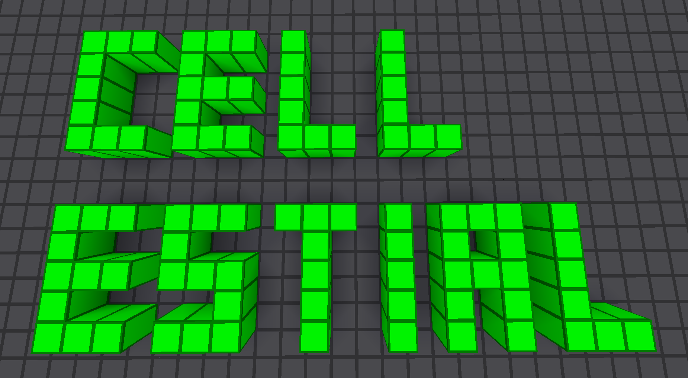

# 3D Cellular Automata (`cellestial`)

An implementation of 3D Cellular Automata for Minetest. Resembles [Flux](https://forum.minetest.net/viewtopic.php?f=15&t=20498).

## About

Cellestial (**cell**-estial) is a mod implementing 3D Cellular Automata in Minetest. Media & code by Lars Mueller aka LMD or appguru(eu). Code licensed under the MIT license, media licensed as CC0. 

Part of the Cellestial Series: [`cellestial`](https://github.com/appgurueu/cellestial), [`cellestiall`](https://github.com/appgurueu/cellestiall) and [`cellestial_game`](https://github.com/appgurueu/cellestial_game)

## Symbolic Representation



## Features

* High Performance
* Intuitive Interfaces
* Powerful API

### Links

* [GitHub](https://github.com/appgurueu/cellestial)
* [Discord](https://discordapp.com/invite/ysP74by)
* [ContentDB](https://content.minetest.net/packages/LMD/cellestial)
* [Minetest Forum](https://forum.minetest.net/viewtopic.php?f=9&t=24456)
* ["Candidates for the Game of Life in Three Dimensions" by Carter Bays](http://wpmedia.wolfram.com/uploads/sites/13/2018/02/01-3-1.pdf)

## Instructions

Available in-game through `/cells help`.

## Configuration

Below is the default configuration, located under `<worldpath>/config/cellestial.json`. It is mostly self-explaining. A few notes:

* `r`, `g`, `b`: Red, green and blue color components
* `max_steps`: Maximum steps per item use / second
* `speedup`: Decrease processing time, but cache more
* `mapcache`: Cache the nodes of the area
* `arena_defaults`: Values used for arenas if not provided

```json
{
  "colors": {
    "cell": {
      "edge": {
        "r": 0,
        "g": 128,
        "b": 0
      },
      "fill": {
        "r": 0,
        "g": 255,
        "b": 0
      }
    },
    "border": {
      "edge": {
        "r": 51,
        "g": 51,
        "b": 51
      },
      "fill": {
        "r": 77,
        "g": 77,
        "b": 77
      }
    }
  },
  "max_steps": 10,
  "request_duration": 30,
  "creative": true,
  "place_inside_player": false,
  "speedup": true,
  "mapcache": false,
  "arena_defaults": {
    "name": "unnamed",
    "dimension": {"x": 80, "y": 80, "z": 80},
    "search_origin": {"x": 0, "y": 0, "z": 0},
    "steps": 1,
    "threshold": 0.5
  }
}
```
